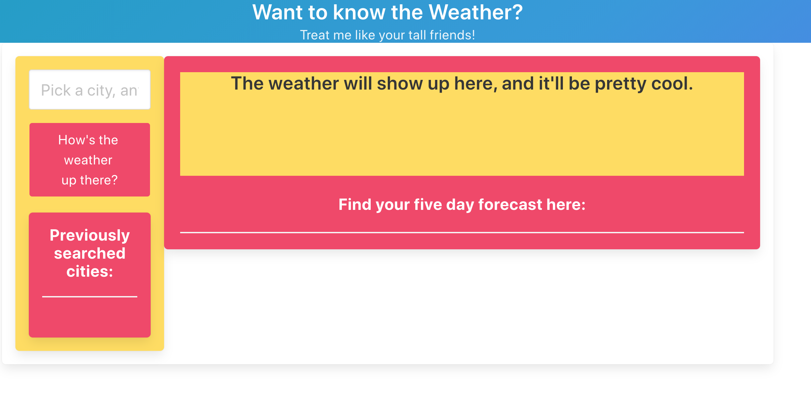
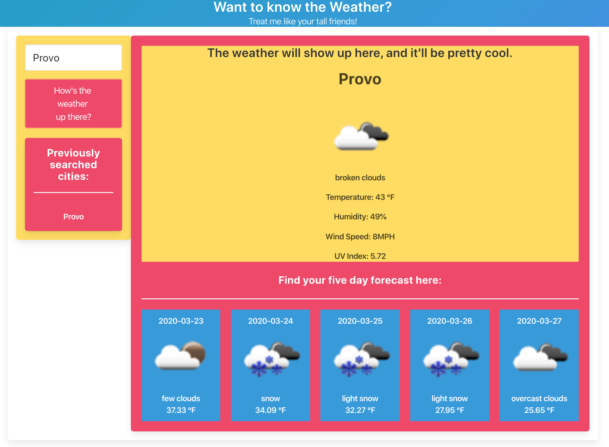
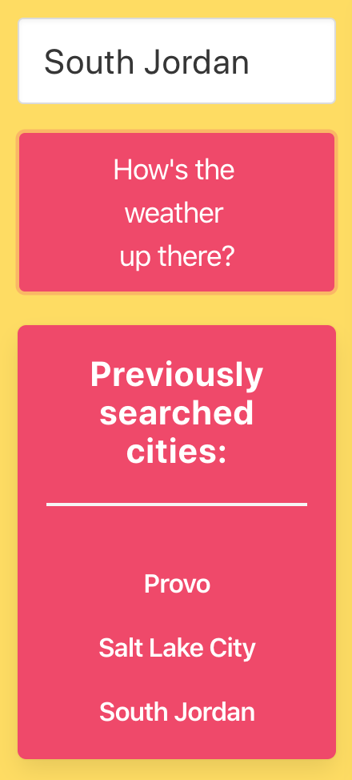
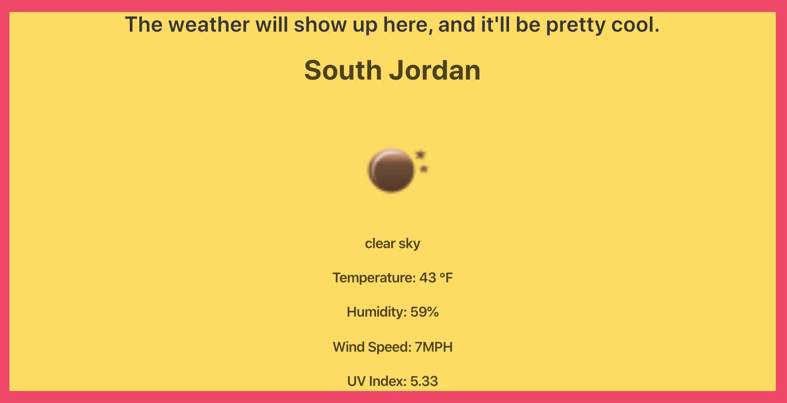
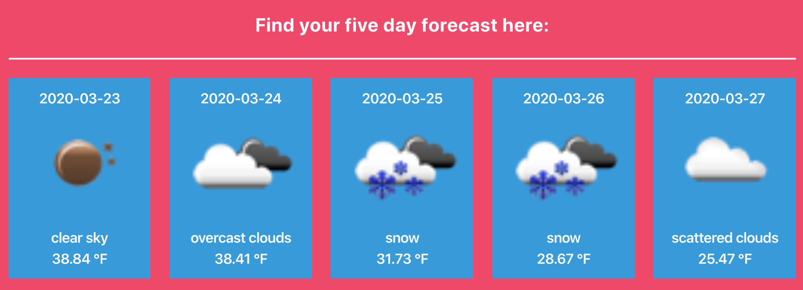

# HowsTheWeather

### Link to the deployed site

https://seanianking.github.io/HowsTheWeather/

## Contents

Below is a picture of the landing page before any searches are completed:

After searching for a city to check the weather, this is how the page will look: 

As you search more cities, each of them will be added to a list below the search areas, and are saved to localStorage so will stay on the page even if you leave the page. 

The main display area will show the current weather and multiple details of that weather:

Starting with the day after the day you search, the bottom area will display the expected weather and temperature of the next five days.
